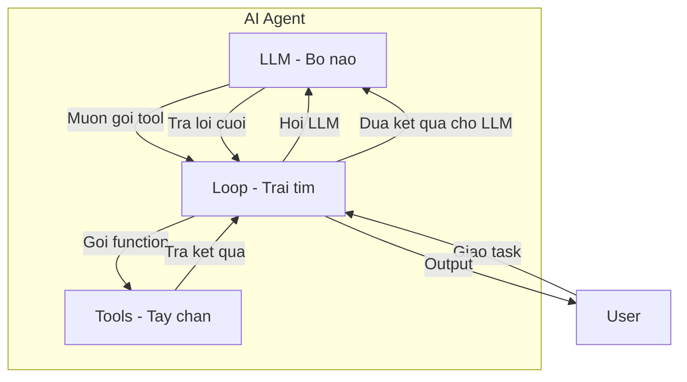
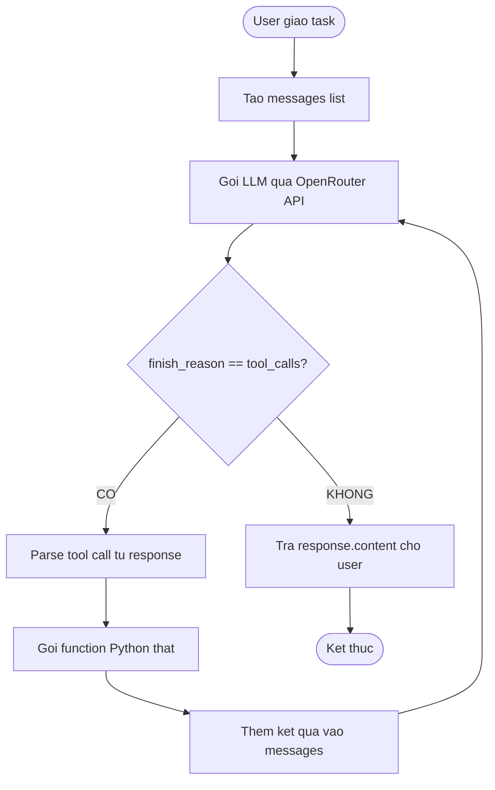
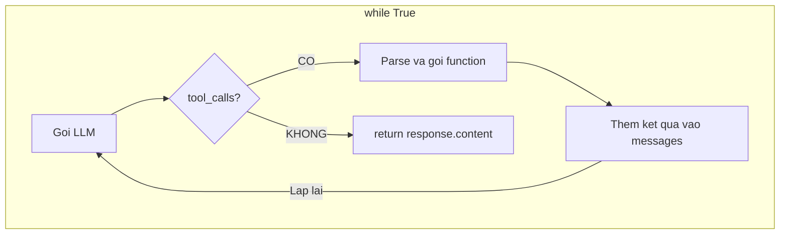
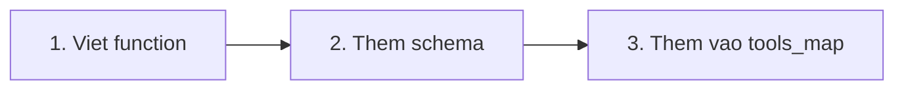

# 🤖 Build Your First Working AI Agent

> VinUni Workshop — ~50 dòng Python. Không framework. Không magic.

## Kiến trúc Agent

```
Agent = LLM + Tools + Loop
```



| Thành phần | Trong code | Vai trò |
|------------|-----------|---------|
| **LLM** | `client.chat.completions.create()` | Suy nghĩ, quyết định gọi tool nào |
| **Tools** | `get_weather()`, `calculate()` | Thực hiện hành động cụ thể |
| **Loop** | `while True` trong `run_agent()` | Điều phối LLM ↔ Tools cho đến khi xong |

## Quick Start

```bash
# 1. Clone repo
git clone https://github.com/mrgoonie/vinuni-first-working-agent.git
cd vinuni-first-working-agent

# 2. Tạo file .env
cp .env.example .env
# Sửa OPENROUTER_API_KEY trong .env

# 3. Cài dependencies
pip install -r requirements.txt

# 4. Chạy!
python agent.py
```

## Lấy API Key

1. Vào [openrouter.ai](https://openrouter.ai/)
2. Đăng ký tài khoản (free)
3. Tạo API key tại [openrouter.ai/keys](https://openrouter.ai/keys)
4. Paste vào file `.env`

## Luồng hoạt động



## Code Walkthrough

### Bước 1: Define Tools
```python
def get_weather(city: str) -> str:
    """Mỗi tool = 1 function Python bình thường"""
    ...

tools_map = {"get_weather": get_weather, "calculate": calculate}
```

### Bước 2: Tool Schema — "Menu" cho LLM
```python
tools_schema = [
    {
        "type": "function",
        "function": {
            "name": "get_weather",
            "description": "Lấy thời tiết hiện tại",
            "parameters": { ... }
        }
    }
]
```

### Bước 3: The Loop — Trái tim của Agent



```python
while True:                          # ← Lặp liên tục
    response = client.chat(...)      # Hỏi LLM
    if response == "tool_calls":     # LLM muốn gọi tool?
        result = tools_map[name]()   #   → Gọi function
        messages.append(result)      #   → Đưa kết quả lại
    else:
        return response.content      # → Xong, trả lời user
```

## Mở rộng Agent

Thêm tool mới chỉ cần 3 bước:



```python
# Ví dụ: Thêm tool tra tỷ giá
def get_exchange_rate(currency: str) -> str:
    rates = {"USD": "25,400 VND", "EUR": "27,800 VND"}
    return rates.get(currency, "N/A")

tools_map["get_exchange_rate"] = get_exchange_rate
# + thêm schema vào tools_schema
```

Ý tưởng: Weather API thật, tin tức, crypto, gửi email, database CRUD...

## Slides

📺 [Xem slides workshop](https://api.agentwiki.cc/s/nLGnEgJFcztu73USoUE8I/)

## License

MIT
