# Hướng dẫn chi tiết: Build Your First Working AI Agent

> Tài liệu kèm theo workshop tại VinUni. Giải thích từng dòng code, kèm diagram.

---

## Mục lục

1. [Tổng quan kiến trúc](#1-tổng-quan-kiến-trúc)
2. [Luồng hoạt động của Agent](#2-luồng-hoạt-động-của-agent)
3. [Bước 1: Define Tools](#3-bước-1-define-tools)
4. [Bước 2: Tool Schema](#4-bước-2-tool-schema)
5. [Bước 3: Agent Loop](#5-bước-3-agent-loop)
6. [Bước 4-5: Chạy thử](#6-bước-4-5-chạy-thử)
7. [Ví dụ thực tế: Multi-tool Task](#7-ví-dụ-thực-tế-multi-tool-task)
8. [Mở rộng Agent](#8-mở-rộng-agent)
9. [Troubleshooting](#9-troubleshooting)

---

## 1. Tổng quan kiến trúc

### Agent = 3 thành phần

```mermaid
graph TB
    subgraph Agent["🤖 AI Agent"]
        LLM["🧠 LLM<br/>(Bộ não)"]
        TOOLS["🔧 Tools<br/>(Tay chân)"]
        LOOP["♻️ Loop<br/>(Trái tim)"]
    end

    USER["👤 User"] -->|"Giao task"| LOOP
    LOOP -->|"Hỏi LLM"| LLM
    LLM -->|"Muốn gọi tool"| LOOP
    LOOP -->|"Gọi function"| TOOLS
    TOOLS -->|"Trả kết quả"| LOOP
    LOOP -->|"Đưa kết quả cho LLM"| LLM
    LLM -->|"Trả lời cuối"| LOOP
    LOOP -->|"Output"| USER

    style Agent fill:#1a1a2e,stroke:#00d4ff,stroke-width:2px
    style LLM fill:#2a2a4e,stroke:#a855f7,stroke-width:2px
    style TOOLS fill:#2a2a4e,stroke:#ff6b35,stroke-width:2px
    style LOOP fill:#2a2a4e,stroke:#00ff88,stroke-width:2px
    style USER fill:#0d0d14,stroke:#fbbf24,stroke-width:2px
```

| Thành phần | Trong code | Vai trò |
|------------|-----------|---------|
| **LLM** | `client.chat.completions.create()` | Suy nghĩ, quyết định gọi tool nào |
| **Tools** | `get_weather()`, `calculate()` | Thực hiện hành động cụ thể |
| **Loop** | `while True` trong `run_agent()` | Điều phối LLM ↔ Tools cho đến khi xong |

### Cấu trúc file

```mermaid
graph LR
    subgraph Repo["📁 vinuni-first-working-agent"]
        AGENT["agent.py<br/>── Code chính ──<br/>144 dòng"]
        ENV[".env<br/>── API key ──<br/>(không commit)"]
        ENVEX[".env.example<br/>── Template ──"]
        REQ["requirements.txt<br/>── Dependencies ──"]
        README["README.md<br/>── Hướng dẫn ──"]
        DOCS["docs/<br/>── Tài liệu ──"]
    end

    AGENT --> ENV
    ENVEX -.->|"copy thành"| ENV

    style AGENT fill:#2a2a4e,stroke:#00d4ff,stroke-width:2px
    style ENV fill:#2a2a4e,stroke:#ff5f57,stroke-width:2px
    style Repo fill:#1a1a2e,stroke:#444,stroke-width:1px
```

---

## 2. Luồng hoạt động của Agent

### Flow tổng quát

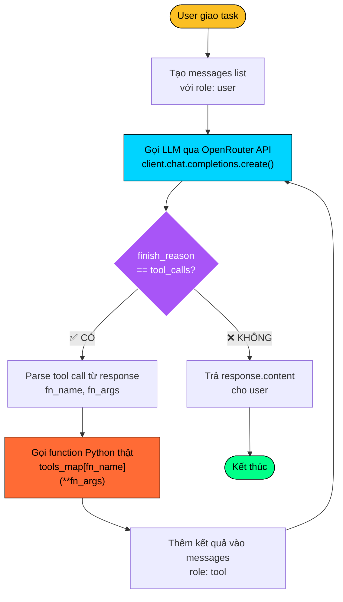

### Sequence Diagram: Task đơn giản (1 tool)

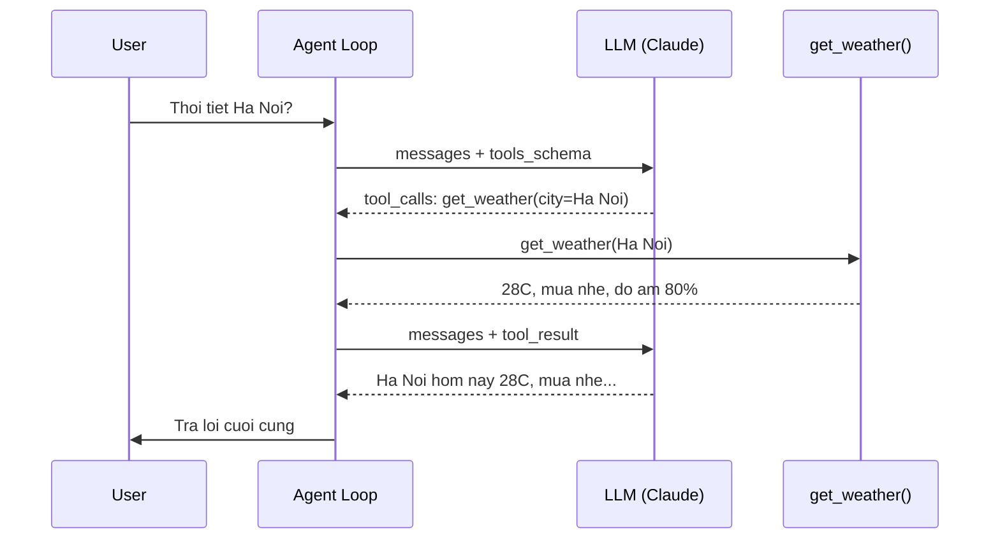

### Sequence Diagram: Multi-tool task

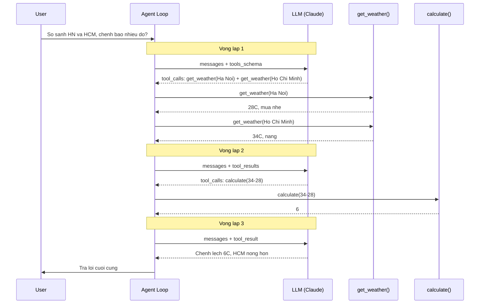

---

## 3. Bước 1: Define Tools

### Giải thích

Tools = các function Python bình thường mà agent có thể gọi.

```python
# File: agent.py, dòng 26-44

def get_weather(city: str) -> str:
    """Lấy thời tiết hiện tại"""
    data = {
        "Ho Chi Minh": "34°C, nắng, độ ẩm 65%",
        "Ha Noi": "28°C, mưa nhẹ, độ ẩm 80%",
        "Da Nang": "30°C, nắng nhẹ, độ ẩm 70%",
    }
    return data.get(city, f"Không có data cho {city}")

def calculate(expression: str) -> str:
    """Tính toán biểu thức toán học"""
    return str(eval(expression))

# Map tên tool → function thật
tools_map = {
    "get_weather": get_weather,
    "calculate": calculate,
}
```

### Diagram: Tools Map

```mermaid
graph LR
    MAP["tools_map (dict)"]
    MAP -->|"'get_weather'"| FN1["get_weather(city)"]
    MAP -->|"'calculate'"| FN2["calculate(expression)"]

    FN1 -->|return| R1["'28°C, mưa nhẹ...'"]
    FN2 -->|return| R2["'6'"]

    style MAP fill:#2a2a4e,stroke:#00d4ff,stroke-width:2px
    style FN1 fill:#2a2a4e,stroke:#ff6b35
    style FN2 fill:#2a2a4e,stroke:#ff6b35
```

**Tại sao cần `tools_map`?** LLM trả về tên tool dưới dạng string (`"get_weather"`). Ta cần map string → function thật để gọi:
```python
result = tools_map["get_weather"](**{"city": "Ha Noi"})
# Tương đương: result = get_weather(city="Ha Noi")
```

---

## 4. Bước 2: Tool Schema

### Giải thích

Tool schema = "menu" mô tả cho LLM biết có những tool nào và nhận tham số gì.

```python
# File: agent.py, dòng 50-85
tools_schema = [
    {
        "type": "function",
        "function": {
            "name": "get_weather",                          # Tên tool
            "description": "Lấy thời tiết hiện tại...",    # Mô tả
            "parameters": {                                  # JSON Schema
                "type": "object",
                "properties": {
                    "city": {
                        "type": "string",
                        "description": "Tên thành phố"
                    }
                },
                "required": ["city"]
            }
        }
    },
    # ... tool calculate tương tự
]
```

### Diagram: Quan hệ Schema ↔ Function

```mermaid
graph TB
    subgraph Schema["📋 Tool Schema (cho LLM đọc)"]
        S1["name: 'get_weather'<br/>description: 'Lấy thời tiết'<br/>params: city (string, required)"]
        S2["name: 'calculate'<br/>description: 'Tính toán'<br/>params: expression (string, required)"]
    end

    subgraph Functions["🔧 Python Functions (code thật)"]
        F1["def get_weather(city: str) -> str"]
        F2["def calculate(expression: str) -> str"]
    end

    subgraph Map["🗺️ tools_map"]
        M["Dict mapping<br/>tên → function"]
    end

    S1 -.->|"LLM chọn"| M
    S2 -.->|"LLM chọn"| M
    M -->|"gọi"| F1
    M -->|"gọi"| F2

    style Schema fill:#1a1a2e,stroke:#a855f7
    style Functions fill:#1a1a2e,stroke:#ff6b35
    style Map fill:#1a1a2e,stroke:#00d4ff
```

**Lưu ý:**
- `name` trong schema **phải khớp** với key trong `tools_map`
- `description` rất quan trọng — LLM dựa vào đó để quyết định dùng tool nào
- `parameters` theo chuẩn [JSON Schema](https://json-schema.org/)

---

## 5. Bước 3: Agent Loop

### Đây là phần quan trọng nhất!

```python
# File: agent.py, dòng 90-121

def run_agent(task: str) -> str:
    messages = [{"role": "user", "content": task}]   # ① Khởi tạo

    while True:                                        # ② LOOP
        response = client.chat.completions.create(     # ③ Gọi LLM
            model=MODEL,
            max_tokens=1024,
            tools=tools_schema,
            messages=messages,
        )

        choice = response.choices[0]

        if choice.finish_reason == "tool_calls":       # ④ LLM muốn gọi tool?
            messages.append(choice.message)

            for tool_call in choice.message.tool_calls:
                fn_name = tool_call.function.name       # ⑤ Parse
                fn_args = json.loads(tool_call.function.arguments)
                result = tools_map[fn_name](**fn_args)  # ⑥ Gọi function

                messages.append({                       # ⑦ Đưa kết quả lại
                    "role": "tool",
                    "tool_call_id": tool_call.id,
                    "content": result,
                })
        else:
            return choice.message.content               # ⑧ Trả lời user
```

### Diagram: Chi tiết bên trong Loop

```mermaid
flowchart TD
    subgraph INIT["① Khởi tạo"]
        M1["messages = [{role: 'user', content: task}]"]
    end

    subgraph LOOP["② while True"]
        CALL["③ Gọi LLM<br/>client.chat.completions.create()"]
        CHECK{"④ finish_reason<br/>== 'tool_calls'?"}
        PARSE["⑤ Parse tool_call<br/>fn_name = tool_call.function.name<br/>fn_args = json.loads(arguments)"]
        EXEC["⑥ Gọi function<br/>result = tools_map[fn_name](**fn_args)"]
        APPEND["⑦ Thêm vào messages<br/>role: 'tool', content: result"]
        RETURN["⑧ return response.content"]
    end

    M1 --> CALL
    CALL --> CHECK
    CHECK -->|"CÓ tool_calls"| PARSE
    PARSE --> EXEC
    EXEC --> APPEND
    APPEND -->|"Lặp lại"| CALL
    CHECK -->|"KHÔNG (end_turn)"| RETURN

    style LOOP fill:#0d0d14,stroke:#00ff88,stroke-width:2px
    style CHECK fill:#a855f7,stroke:#fff,color:#fff
    style EXEC fill:#ff6b35,stroke:#fff,color:#fff
    style RETURN fill:#00ff88,stroke:#000,color:#000
```

### Messages array qua từng vòng lặp

```mermaid
graph TD
    subgraph V0["Khởi tạo"]
        M0["[{role: 'user', content: 'Thời tiết HN?'}]"]
    end

    subgraph V1["Sau vòng 1: LLM gọi tool"]
        M1["[
            {role: 'user', content: 'Thời tiết HN?'},
            {role: 'assistant', tool_calls: [get_weather('Ha Noi')]},
            {role: 'tool', content: '28°C, mưa nhẹ'}
        ]"]
    end

    subgraph V2["Sau vòng 2: LLM trả lời"]
        M2["[
            ...tất cả messages trên...,
            {role: 'assistant', content: 'HN hôm nay 28°C...'}
        ] → return cho user"]
    end

    V0 -->|"Gọi LLM"| V1
    V1 -->|"Gọi LLM lần 2"| V2

    style V0 fill:#1a1a2e,stroke:#fbbf24
    style V1 fill:#1a1a2e,stroke:#00d4ff
    style V2 fill:#1a1a2e,stroke:#00ff88
```

---

## 6. Bước 4-5: Chạy thử

```python
# File: agent.py, dòng 126-144

if __name__ == "__main__":
    # Task 1: Đơn giản (1 tool, 2 vòng lặp)
    answer = run_agent("Thời tiết Hà Nội hôm nay thế nào?")

    # Task 2: Phức tạp (multi-tool, 3 vòng lặp)
    answer = run_agent(
        "So sánh thời tiết Hà Nội và HCM. "
        "Chênh lệch nhiệt độ bao nhiêu độ?"
    )
```

### Output mẫu

```
==================================================
🤖 VinUni Agent — Demo
==================================================

📝 Task 1: Thời tiết Hà Nội
------------------------------
  🔧 get_weather({'city': 'Ha Noi'}) → 28°C, mưa nhẹ, độ ẩm 80%

💬 Thời tiết hôm nay ở Hà Nội: 28°C, mưa nhẹ, độ ẩm 80%

📝 Task 2: So sánh thời tiết + tính toán
------------------------------
  🔧 get_weather({'city': 'Ha Noi'}) → 28°C, mưa nhẹ, độ ẩm 80%
  🔧 get_weather({'city': 'Ho Chi Minh'}) → 34°C, nắng, độ ẩm 65%
  🔧 calculate({'expression': '34-28'}) → 6

💬 Chênh lệch 6°C, HCM nóng hơn Hà Nội.
```

---

## 7. Ví dụ thực tế: Multi-tool Task

### Phân tích từng bước

```mermaid
sequenceDiagram
    participant U as User
    participant Loop as Agent Loop
    participant LLM as Claude
    participant W as get_weather
    participant C as calculate

    U->>Loop: So sanh HN va HCM, chenh bao nhieu?

    rect rgb(40, 40, 80)
        Note over Loop,LLM: Vong lap 1
        Loop->>LLM: messages (1 msg)
        LLM-->>Loop: finish_reason: tool_calls
        Note over LLM: Can data 2 thanh pho
        Loop->>W: get_weather(Ha Noi)
        W-->>Loop: 28C, mua nhe
        Loop->>W: get_weather(Ho Chi Minh)
        W-->>Loop: 34C, nang
    end

    rect rgb(40, 60, 40)
        Note over Loop,LLM: Vong lap 2
        Loop->>LLM: messages (4 msgs)
        LLM-->>Loop: finish_reason: tool_calls
        Note over LLM: Tinh chenh lech: 34-28
        Loop->>C: calculate(34-28)
        C-->>Loop: 6
    end

    rect rgb(60, 40, 60)
        Note over Loop,LLM: Vong lap 3 (cuoi)
        Loop->>LLM: messages (6 msgs)
        LLM-->>Loop: finish_reason: stop
        Note over LLM: Du data roi, tra loi thoi
    end

    Loop->>U: HCM nong hon HN 6C
```

**Điểm quan trọng:** LLM tự quyết định:
- Cần gọi những tool nào
- Gọi theo thứ tự nào
- Khi nào đã đủ thông tin để trả lời

Code của bạn **không** chỉ định logic này — chỉ cung cấp "menu" (schema) và chạy loop.

---

## 8. Mở rộng Agent

### Thêm tool mới chỉ cần 3 bước:

```mermaid
flowchart LR
    A["1️⃣ Viết function"] --> B["2️⃣ Thêm schema"] --> C["3️⃣ Thêm vào tools_map"]

    style A fill:#2a2a4e,stroke:#00d4ff
    style B fill:#2a2a4e,stroke:#a855f7
    style C fill:#2a2a4e,stroke:#00ff88
```

**Ví dụ: Thêm tool tra cứu tỷ giá**

```python
# Bước 1: Viết function
def get_exchange_rate(currency: str) -> str:
    rates = {"USD": "25,400 VND", "EUR": "27,800 VND"}
    return rates.get(currency, f"Không có tỷ giá cho {currency}")

# Bước 2: Thêm vào tools_map
tools_map["get_exchange_rate"] = get_exchange_rate

# Bước 3: Thêm schema
tools_schema.append({
    "type": "function",
    "function": {
        "name": "get_exchange_rate",
        "description": "Tra cứu tỷ giá ngoại tệ sang VND",
        "parameters": {
            "type": "object",
            "properties": {
                "currency": {
                    "type": "string",
                    "description": "Mã tiền tệ (VD: USD, EUR)"
                }
            },
            "required": ["currency"]
        }
    }
})
```

### Ý tưởng mở rộng

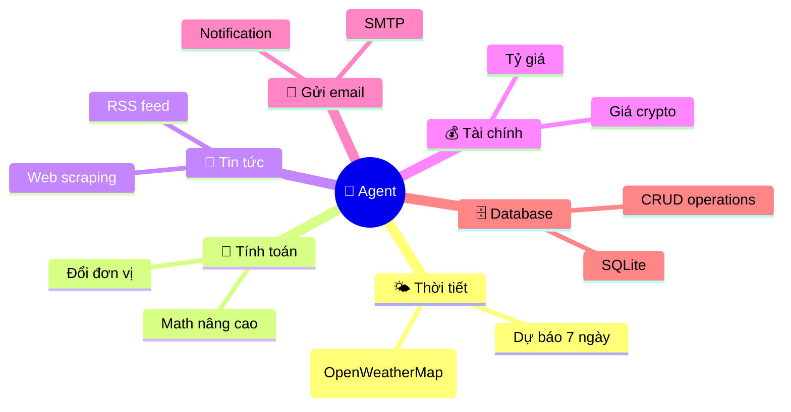

---

## 9. Troubleshooting

| Lỗi | Nguyên nhân | Cách sửa |
|------|-------------|----------|
| `openai.AuthenticationError` | API key sai hoặc hết hạn | Kiểm tra `.env`, tạo key mới tại openrouter.ai |
| `ModuleNotFoundError: openai` | Chưa cài dependencies | `pip install -r requirements.txt` |
| `KeyError` trong `tools_map` | Tên tool trong schema ≠ key trong map | Đảm bảo `name` trong schema khớp với key trong `tools_map` |
| `json.JSONDecodeError` | LLM trả về arguments không hợp lệ | Thử model khác hoặc improve description |
| Rate limit (429) | Gọi API quá nhanh | Thêm `time.sleep(1)` giữa các request |

### Kiểm tra nhanh

```bash
# Kiểm tra API key hoạt động
python -c "
from dotenv import load_dotenv
from openai import OpenAI
import os
load_dotenv()
client = OpenAI(base_url='https://openrouter.ai/api/v1', api_key=os.getenv('OPENROUTER_API_KEY'))
r = client.chat.completions.create(model='anthropic/claude-sonnet-4', max_tokens=10, messages=[{'role':'user','content':'Hi'}])
print('✅ API hoạt động!', r.choices[0].message.content)
"
```

---

## Tài nguyên thêm

- [Slides workshop](https://api.agentwiki.cc/s/nLGnEgJFcztu73USoUE8I/)
- [OpenRouter docs](https://openrouter.ai/docs)
- [Anthropic tool use guide](https://docs.anthropic.com/en/docs/build-with-claude/tool-use/overview)
- [OpenAI function calling](https://platform.openai.com/docs/guides/function-calling)
